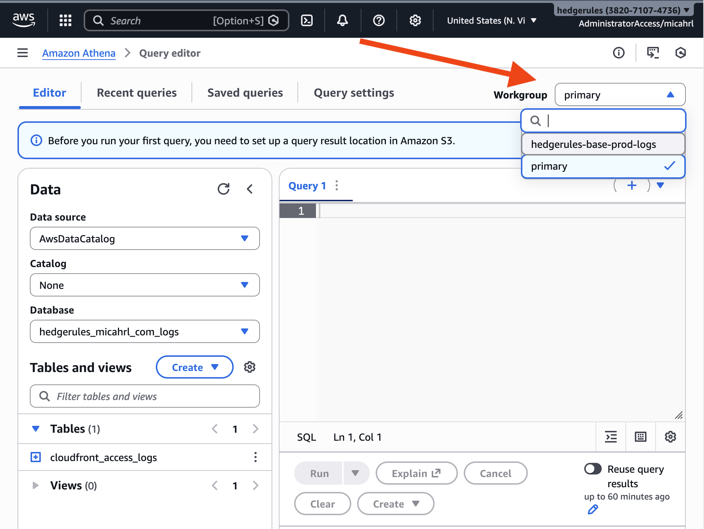

You can use AWS Athena to get access logs.

## Deploying Athena

TODO: Write more detailed docs.

For now, look at
[hedgerules production infrastructure]()
as an example

## Querying Athena

Query in AWS Console: Athena → Sidebar hamburger menu → Query Editor.

Make sure you select the correct Athena workgroup in the upper right.
You probably created a workgroup for Hedgerules logs
([hedgerules production infrastructure]() does),
but by default a `primary` workgroup is created and selected when loading Athena.

<details>
  <summary>Screenshot of the workgroup selection box</summary>
  
</details>

The following assumes a database name of `hedgerules_micahrl_com_logs`
and a table name of `cloudfront_access_logs`.
The column names depend on the `StorageDescriptor` items on the `AthenaLogsTable` object deployed to AWS.

### Popular pages

```sql
-- Top 10 pages by requests with domain
SELECT host_header, uri_stem, COUNT(*) as requests
FROM hedgerules_micahrl_com_logs.cloudfront_access_logs
GROUP BY host_header, uri_stem
ORDER BY requests DESC
LIMIT 10;

-- Top 10 paths
SELECT uri_stem, COUNT(*) as requests
FROM hedgerules_micahrl_com_logs.cloudfront_access_logs
GROUP BY uri_stem
ORDER BY requests DESC
LIMIT 10;
```

### Errors

```sql
-- 404 errors
SELECT host_header, uri_stem, COUNT(*) as count
FROM hedgerules_micahrl_com_logs.cloudfront_access_logs
WHERE status_code = 404
GROUP BY host_header, uri_stem
ORDER BY count DESC;

-- Traffic by status code
SELECT status_code, COUNT(*) as requests
FROM hedgerules_micahrl_com_logs.cloudfront_access_logs
GROUP BY status_code
ORDER BY requests DESC;

```

### Detailed access logs

```sql
-- Recent requests with full details (user agent, IP, referer, etc.)
SELECT log_date, log_time, client_ip, http_method, uri_stem, status_code,
       url_decode(user_agent) as user_agent, url_decode(referer) as referer,
       bytes_sent, time_taken
FROM hedgerules_micahrl_com_logs.cloudfront_access_logs
ORDER BY log_date DESC, log_time DESC
LIMIT 100;

-- Requests from a specific IP
SELECT log_date, log_time, http_method, uri_stem, status_code,
       url_decode(user_agent) as user_agent
FROM hedgerules_micahrl_com_logs.cloudfront_access_logs
WHERE client_ip = '203.0.113.50'
ORDER BY log_date DESC, log_time DESC;

-- Requests matching a specific user agent substring
SELECT log_date, log_time, client_ip, uri_stem,
       url_decode(user_agent) as user_agent
FROM hedgerules_micahrl_com_logs.cloudfront_access_logs
WHERE LOWER(url_decode(user_agent)) LIKE '%googlebot%'
ORDER BY log_date DESC, log_time DESC
LIMIT 100;
```

### Bot and crawler analysis

```sql
-- Top user agents by request count
SELECT url_decode(user_agent) as user_agent, COUNT(*) as requests
FROM hedgerules_micahrl_com_logs.cloudfront_access_logs
GROUP BY user_agent
ORDER BY requests DESC
LIMIT 25;

-- AI crawler traffic
SELECT url_decode(user_agent) as user_agent,
       COUNT(*) as requests, COUNT(DISTINCT client_ip) as unique_ips
FROM hedgerules_micahrl_com_logs.cloudfront_access_logs
WHERE LOWER(url_decode(user_agent)) LIKE '%gptbot%'
   OR LOWER(url_decode(user_agent)) LIKE '%claudebot%'
   OR LOWER(url_decode(user_agent)) LIKE '%bytespider%'
   OR LOWER(url_decode(user_agent)) LIKE '%ccbot%'
   OR LOWER(url_decode(user_agent)) LIKE '%perplexitybot%'
   OR LOWER(url_decode(user_agent)) LIKE '%amazonbot%'
   OR LOWER(url_decode(user_agent)) LIKE '%google-extended%'
GROUP BY user_agent
ORDER BY requests DESC;

-- Suspected vulnerability scanners (probing for common exploits)
SELECT client_ip, uri_stem, url_decode(user_agent) as user_agent,
       COUNT(*) as requests
FROM hedgerules_micahrl_com_logs.cloudfront_access_logs
WHERE uri_stem LIKE '%wp-admin%'
   OR uri_stem LIKE '%wp-login%'
   OR uri_stem LIKE '%.env%'
   OR uri_stem LIKE '%.git%'
   OR uri_stem LIKE '%phpmyadmin%'
GROUP BY client_ip, uri_stem, user_agent
ORDER BY requests DESC
LIMIT 50;
```

### Traffic patterns

```sql
-- Requests per day
SELECT log_date, COUNT(*) as requests
FROM hedgerules_micahrl_com_logs.cloudfront_access_logs
GROUP BY log_date
ORDER BY log_date DESC;

-- Bandwidth per day (MB)
SELECT log_date,
       ROUND(SUM(bytes_sent) / 1048576.0, 2) as mb_sent,
       ROUND(SUM(bytes_received) / 1048576.0, 2) as mb_received
FROM hedgerules_micahrl_com_logs.cloudfront_access_logs
GROUP BY log_date
ORDER BY log_date DESC;

-- Top referrers (where traffic comes from)
SELECT url_decode(referer) as referer, COUNT(*) as requests
FROM hedgerules_micahrl_com_logs.cloudfront_access_logs
WHERE referer != '-'
GROUP BY referer
ORDER BY requests DESC
LIMIT 25;

-- Cache hit rate by day
SELECT log_date,
       COUNT(*) as total,
       SUM(CASE WHEN edge_result_type = 'Hit' THEN 1 ELSE 0 END) as hits,
       ROUND(100.0 * SUM(CASE WHEN edge_result_type = 'Hit' THEN 1 ELSE 0 END) / COUNT(*), 1) as hit_pct
FROM hedgerules_micahrl_com_logs.cloudfront_access_logs
GROUP BY log_date
ORDER BY log_date DESC;

-- Traffic by edge location
SELECT edge_location, COUNT(*) as requests
FROM hedgerules_micahrl_com_logs.cloudfront_access_logs
GROUP BY edge_location
ORDER BY requests DESC
LIMIT 20;
```
