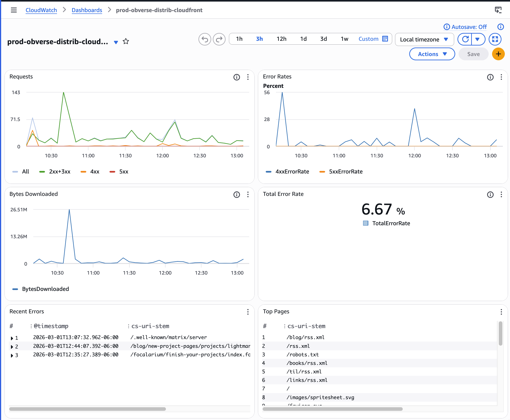
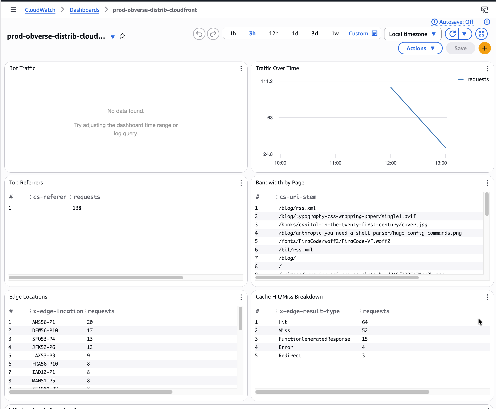
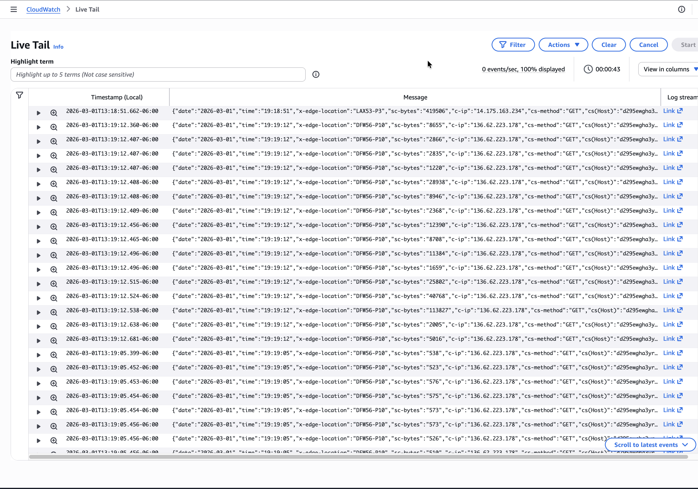

Hedgerules can deliver CloudFront access logs to CloudWatch Logs and provision a CloudWatch dashboard,
giving you real-time log queries and a live metrics overview.

## Deploying CloudWatch observability

TODO: Write more detailed docs.

For now, look at
[hedgerules production infrastructure]()
as an example.

## Observability dashboard

CloudWatch dashboards provide basic observability.
Here are some example screenshots from the dashboard for my main website.





## Log streaming

CloudWatch can also show real time logs.
That looks like this:



## Real-time log queries

Logs are delivered to CloudWatch Logs as structured JSON under the log group `/aws/cloudfront/{stack-name}`.
You can query them directly in the AWS Console under **CloudWatch → Logs Insights**.

Select the `/aws/cloudfront/{stack-name}` log group, then run queries against the fields in the CloudFront access log format.

For historical trend analysis across large date ranges,
you'll want to use [Athena]() instead.

### Recent errors

```
fields @timestamp, `cs-uri-stem`, `sc-status`, `c-ip`
| filter `sc-status` >= 400
| sort @timestamp desc
| limit 50
```

### Top pages

```
stats count(*) as requests by `cs-uri-stem`
| sort requests desc
| limit 25
```

### Bot traffic

```
filter `cs-user-agent` like "gptbot"
  or `cs-user-agent` like "claudebot"
  or `cs-user-agent` like "bytespider"
  or `cs-user-agent` like "ccbot"
  or `cs-user-agent` like "perplexitybot"
  or `cs-user-agent` like "amazonbot"
  or `cs-user-agent` like "google-extended"
| stats count(*) as requests by `cs-user-agent`
| sort requests desc
```

### Traffic over time

```
stats count(*) as requests by bin(1h)
| sort @timestamp asc
```

### Top referrers

```
filter `cs-referer` != "-"
| stats count(*) as requests by `cs-referer`
| sort requests desc
| limit 25
```

### Bandwidth by page

```
stats sum(`sc-bytes`) as bytes by `cs-uri-stem`
| sort bytes desc
| limit 25
```

### Edge locations

```
stats count(*) as requests by `x-edge-location`
| sort requests desc
| limit 25
```

### Cache hit/miss breakdown

```
stats count(*) as requests by `x-edge-result-type`
| sort requests desc
```
